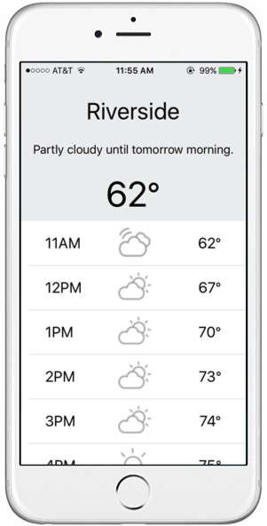

Weather
==========================


Weather is an iOS app that utilizes the Dark Sky Forecast API to display the current and future weather for your current location.  It also displays a summary of the weather for the entire day as well as helpful weather icons.

## Requirements

* XCode 7.3 (or higher)
* iOS 9 SDK (or higher)

## Instructions

1. Get the code in this repository.
2. Double-click the  ```Weather.xcworkspace``` file.
3. To get it on your iOS device plug the device into your computer and select it as the target and press Run!

## Issues

There are no known bugs.  Feedback and requests are always welcome!

## Licensing

Licensed under the Apache License, Version 2.0 (the "License");
you may not use this file except in compliance with the License.
You may obtain a copy of the License at

   http://www.apache.org/licenses/LICENSE-2.0

Unless required by applicable law or agreed to in writing, software
distributed under the License is distributed on an "AS IS" BASIS,
WITHOUT WARRANTIES OR CONDITIONS OF ANY KIND, either express or implied.
See the License for the specific language governing permissions and
limitations under the License.

A copy of the license is available in the repository's [LICENSE](https://github.com/jaystu/Weather/blob/master/LICENSE) file.
